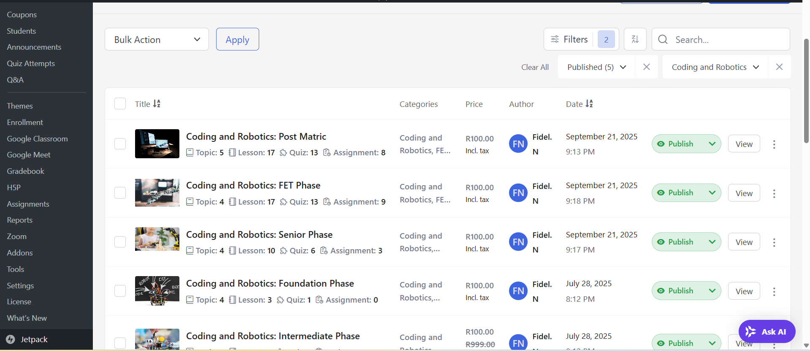
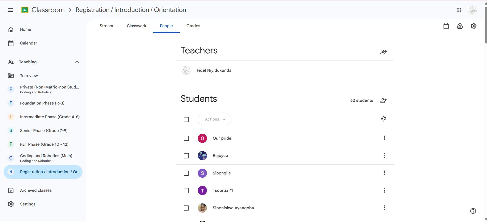
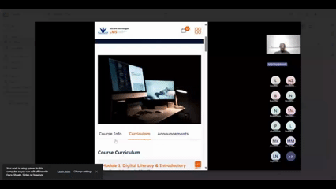
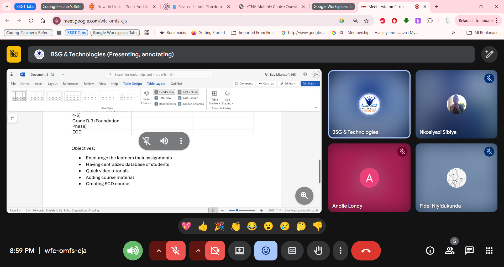
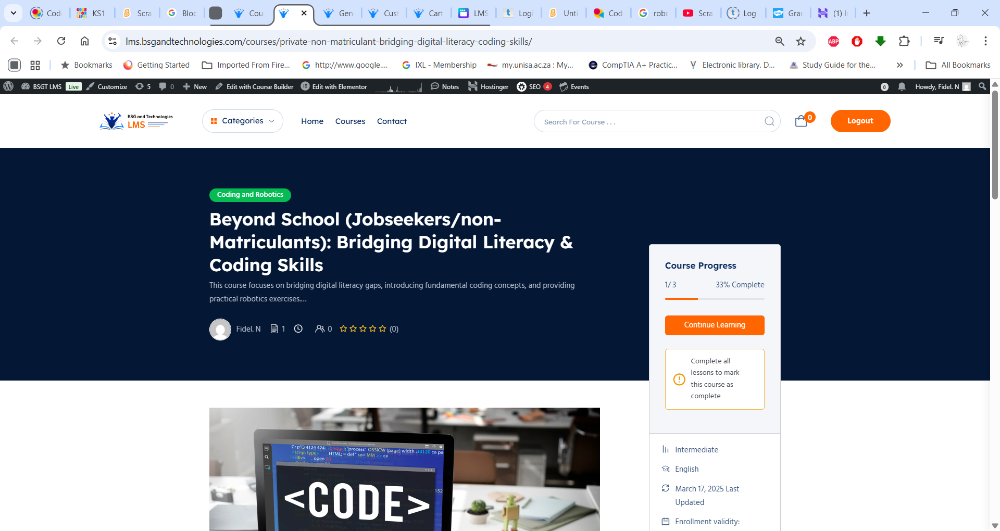
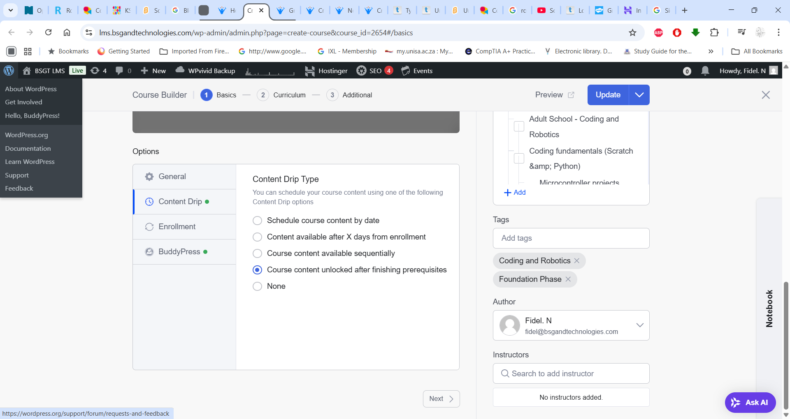
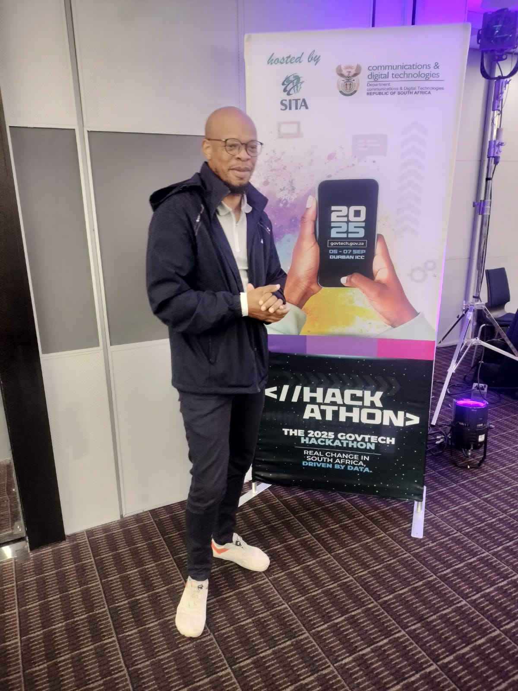
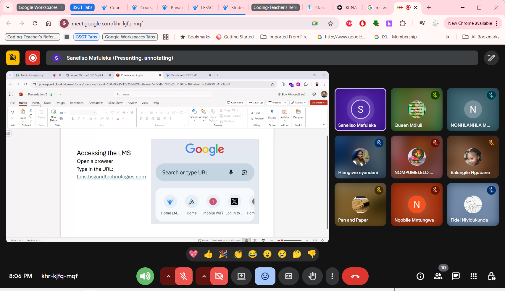
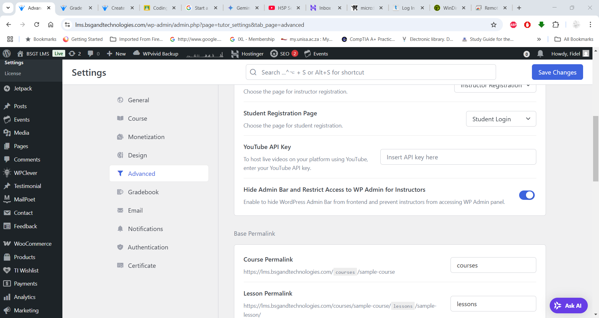

# Hey, I'm Fidel

## Full-Stack Developer & Network Engineer | Building Reliable Learning Platforms

> *"I combine full-stack development expertise with network engineering reliability to build educational platforms that actually work - while teaching real students gives me the unique insight most developers lack."*

<div align="center">

[](https://linkedin.com/in/niyidukunda)
[](https://github.com/niyidukunda)
[](https://fidel-devprojects.vercel.app/)
[](mailto:finiyid@gmail.com)

</div>

---

## Current Educational Technology Experience

### **Learning Platform Developer & Technical Facilitator**
**Daily work:** Building and maintaining educational software while teaching **coding and robotics** to students from remote and underserved backgrounds.

<div align="center">
<a href="images/server-side-LMS-list-of-published-courses.png" target="_blank">

</a>
<p><em>📸 Server-side LMS interface showing published coding and robotics courses I've developed and maintain (click to enlarge)</em></p>
</div>

**Technical responsibilities:**
- Develop and maintain LMS platform architecture
- Build educational content delivery systems
- Implement robust offline/online sync capabilities
- Collaborate on group educational repositories
- Ensure platform reliability for distributed learning

<div align="center">
<a href="images/integration-with-google-classroom.png" target="_blank">

</a>
<p><em>🔗 Google Classroom integration for seamless learning management across platforms (click to enlarge)</em></p>
</div>

**Teaching responsibilities:**
- Facilitate coding courses for remote students
- Create interactive learning modules and exercises
- Bridge complex technical concepts for beginners
- Support students with diverse technical backgrounds

<div align="center">
<a href="images/online-session-demo.gif" target="_blank">

</a>
<p><em>🎥 Live coding session demonstrating interactive teaching methodology for remote students (click to enlarge)</em></p>
</div>

**Real-world insight:** This combination gives me unique perspective on what educators and students actually need from learning platforms - not just what sounds good in requirements docs.

---

## What Makes Me Different as a Full-Stack Developer

**Most developers** build applications without seeing how real users interact with them daily.  
**Most network engineers** understand reliability but don't build user-facing applications.  
**I combine both** - plus I get direct user feedback from teaching students, making me a more effective developer across any domain.

### My Full-Stack Development Advantage:
- **Real User Feedback**: I see daily how users actually interact with applications, not just what analytics show
- **Network Engineering Mindset**: I build applications with enterprise-level reliability and performance thinking
- **End-to-End Development**: I handle everything from database optimization to user interface design
- **Technical Communication**: I can explain complex concepts to both technical teams and end users

<div align="center">
<a href="images/team-collaboration.png" target="_blank">

</a>
<p><em>🤝 Team collaboration on educational platform development - combining technical expertise with pedagogical insights (click to enlarge)</em></p>
</div>

---

## About Me

I'm a **Full-Stack Developer and Network Engineer** with **CCNA** and **CompTIA Security+** certifications, currently applying my comprehensive web development skills to build learning management systems while teaching **coding and robotics** to students from remote backgrounds.

**What makes me unique as a developer?** I don't just build applications - I use them daily to teach real students. This gives me user experience insights that most full-stack developers never get, allowing me to build better, more intuitive software regardless of the domain.

**Technical approach:** I apply enterprise-level reliability principles from network engineering to full-stack development, creating robust applications that work consistently even in challenging conditions - a skill set that's valuable across all industries.

```javascript
const fidel = {
    specialization: "Full-Stack Development with Real-World User Experience",
    code: ["JavaScript", "HTML", "CSS", "Node.js", "Python", "SQL"],
    frameworks: ["Express.js", "React", "EJS", "Bootstrap", "jQuery"],
    databases: ["MongoDB", "MySQL", "SQLite"],
    tools: ["Git", "VS Code", "Postman", "npm", "Mongoose"],
    architecture: ["Learning Management Systems", "RESTful APIs", "MVC Pattern"],
    networking: ["CCNA", "CompTIA Security+", "A+", "Network+", "OSPF", "RSTP"],
    edtech: {
        experience: "Teaching coding & robotics to remote students",
        platforms: "LMS development and maintenance",
        impact: "Making technology accessible to underserved communities"
    },
    currentFocus: "Applying full-stack skills to solve real-world user problems",
    uniqueAdvantage: "Network engineering reliability + real user feedback from teaching"
};
```

---

## Tech Stack

### **Frontend Development**


### **Backend Development**


### **Database & Cloud**


### **Tools & Platforms**


---

## Education & Community Impact

### **LMS Platform Development & Technical Facilitation**
Currently developing and maintaining learning management systems while teaching **coding and robotics** to students from remote and underserved backgrounds. This work combines my technical skills with my passion for making technology accessible to everyone.

**What I do:**
- Build and maintain LMS platforms for educational delivery
- Facilitate coding courses for remote students
- Develop educational content and interactive learning modules
- Collaborate on open-source educational projects (multiple repositories)
- Bridge the gap between complex technical concepts and beginner understanding

**Impact:** Helping bring coding education to communities that traditionally lack access to tech resources.

<div align="center">
<a href="images/dashboard-to-one-of-our-popular-courses.png" target="_blank">

</a>
<p><em>📊 Course dashboard showing engagement metrics for one of our most popular coding and robotics programs (click to enlarge)</em></p>
</div>

<div align="center">
<a href="images/course-from-scratch.png" target="_blank">

</a>
<p><em>🛠️ Building educational content from scratch - designing curriculum that bridges theory with hands-on practice (click to enlarge)</em></p>
</div>

---

## Featured Projects

### [Purpose & Perspective Blog](https://github.com/niyidukunda/webDev/tree/main/Backend/BLOG%20WebApp)
**Learning Platform Architecture Demonstration | Production-Ready**

A blog application with intelligent fallback systems that demonstrates the reliability principles I apply to educational platforms. When students are learning remotely, platforms can't afford to be down.

- **Tech Stack**: Node.js, Express, MongoDB Atlas, EJS, Mongoose
- **Educational Applications**: Dual-storage for offline capability, auto-reconnection for unreliable networks
- **Learning Platform Features**: User content management, responsive design, status notifications
- **Reliability Engineering**: Built with the same failover logic I use in academic technology systems
- **Production Ready**: Environment configured, deployment-ready architecture
- **Code**: [View Source](https://github.com/niyidukunda/webDev/tree/main/Backend/BLOG%20WebApp)

### [Band Name Generator](https://github.com/niyidukunda/webDev/tree/main/Backend/4.4%20Band%20Generator%20Project)
**Creative Web App | EJS Templating**

Dynamic band name generator using EJS templating with modern UI design and responsive layout.

- **Tech Stack**: Node.js, Express, EJS, Bootstrap
- **Features**: Random name generation, responsive design, modular templates
- **Live Demo**: [Run Locally](https://github.com/niyidukunda/webDev/tree/main/Backend/4.4%20Band%20Generator%20Project#-quick-start) | **Code**: [View Source](https://github.com/niyidukunda/webDev/tree/main/Backend/4.4%20Band%20Generator%20Project)

### [Authentication System](https://github.com/niyidukunda/webDev/tree/main/Backend/3.5%20Secrets%20Project)
**Secure Login Portal | Middleware Implementation**

Comprehensive authentication system with password validation and session management.

- **Tech Stack**: Node.js, Express, Custom Middleware
- **Features**: Secure authentication, session handling, input validation
- **Security**: Password hashing, route protection, CSRF prevention
- **Live Demo**: [Try Authentication](https://github.com/niyidukunda/webDev/tree/main/Backend/3.5%20Secrets%20Project#-live-demo) | **Code**: [View Source](https://github.com/niyidukunda/webDev/tree/main/Backend/3.5%20Secrets%20Project)

### [QR Code Generator](https://github.com/niyidukunda/webDev/tree/main/Backend/2.4%20QR%20Code%20Project)
**Utility Application | NPM Integration**

Professional QR code generation tool with file output and URL encoding capabilities.

- **Tech Stack**: Node.js, NPM packages, File System operations
- **Features**: URL encoding, SVG/PNG export, file management
- **Use Cases**: Marketing materials, contact cards, website links
- **CLI Demo**: [Run Generator](https://github.com/niyidukunda/webDev/tree/main/Backend/2.4%20QR%20Code%20Project#-quick-start) | **Code**: [View Source](https://github.com/niyidukunda/webDev/tree/main/Backend/2.4%20QR%20Code%20Project)

---

## GitHub Analytics

<div align="center">


</div>

---

## Professional Experience

### **Founder & Lead Developer** | *Del IT+Web* | *2023 - Present*
- **Business Development**: Built and manage a web development consultancy
- **Technical Leadership**: Architect and develop custom web solutions for clients
- **Project Management**: Lead full project lifecycles from requirements to deployment
- **Client Relations**: Maintain long-term partnerships with diverse business clients

### **Continuous Learning Journey**
- **Web Development Bootcamp**: Comprehensive full-stack development training
- **Progressive Skill Building**: From HTML fundamentals to advanced Node.js applications
- **Real-World Projects**: Building production-ready applications with modern best practices

<div align="center">
<a href="images/govtech-hackathon2025.jpg" target="_blank">

</a>
<p><em>🏆 Participating in GovTech Hackathon 2025 - applying educational technology expertise to government innovation challenges (click to enlarge)</em></p>
</div>

---

## What I'm Currently Working On

### **Active Full-Stack Projects**
- **Learning Platform Development**: Full-stack web applications for coding/robotics education with real user testing
- **User Experience Optimization**: Direct feedback from teaching allows rapid iteration and improvement
- **Reliability Engineering**: Implementing robust offline/sync capabilities using network engineering principles

<div align="center">
<a href="images/online-class-in-session.png" target="_blank">

</a>
<p><em>👨‍🏫 Online coding class in session - demonstrating interactive teaching methods for remote students (click to enlarge)</em></p>
</div>

<div align="center">
<a href="images/Packet Tracer Demo-Simple Lan.gif" target="_blank">

</a>
<p><em>🌐 Teaching network fundamentals using Cisco Packet Tracer - bridging networking concepts with digital learning delivery (click to enlarge)</em></p>
</div>

### **Next Big Full-Stack Challenge: Enhanced Kolibri Platform**
Planning a comprehensive full-stack modification of the Kolibri learning platform showcasing:
- **Offline-First Architecture**: Complex state management and data synchronization challenges
- **Smart Content Sync**: Advanced full-stack integration with intelligent conflict resolution
- **Scalable Architecture**: Cloud-native deployment with network engineering reliability principles
- **Open Source Contribution**: Demonstrating full-stack capabilities in a real-world, high-impact project

### **Technical Development**
- **Learning React**: Expanding full-stack capabilities with modern frontend frameworks for interactive applications
- **AWS + Kubernetes**: Building cloud-native architecture skills for scalable, reliable application deployment
- **Current Focus**: React.js integration with existing Node.js/Express backend expertise
- **Growing**: Del IT+Web client portfolio across various industries using full-stack expertise
- **Planning**: Open-source contributions to developer tools and frameworks

<div align="center">
<a href="images/generating-api-keys-for-google-integration.png" target="_blank">

</a>
<p><em>⚙️ Setting up Google API integrations for enhanced learning platform functionality and third-party service connectivity (click to enlarge)</em></p>
</div>

---

## Let's Connect & Collaborate

I'm always interested in connecting with fellow full-stack developers, potential clients, and collaborators who share a passion for building reliable, user-focused web applications.

### **Open to:**
- **Freelance Projects**: Custom web development and consulting
- **Collaborations**: Open-source contributions and joint ventures
- **Business Opportunities**: Partnership and client engagements
- **Mentoring**: Helping new developers navigate their learning journey

### **Get In Touch:**
- **Business Inquiries**: [Del IT+Web](https://delitweb.co.za)
- **Professional Network**: [LinkedIn](https://linkedin.com/in/fidel-niyidukunda)
- **Direct Contact**: finiyid@gmail.com
- **WhatsApp Business**: +27 677188232

---

## Fun Facts About Me

- **Location**: Johannesburg, South Africa - bringing African innovation to global web development
- **Coding Fuel**: Coffee enthusiast - best code written between 2nd and 4th cups
- **Philosophy**: "Clean code is not just about making it work, it's about making it maintainable"
- **Goal**: Building Del IT+Web into South Africa's premier boutique IT Consulting agency
- **Hobby**: Writing technical tutorials and sharing development insights on my blog

---

<div align="center">

### *"Great software is built by passionate developers who care about their craft"*

**Thank you for visiting my profile! Feel free to explore my repositories and reach out for collaborations.**


</div>

---

*Last updated: September 2025 | Built in South Africa*